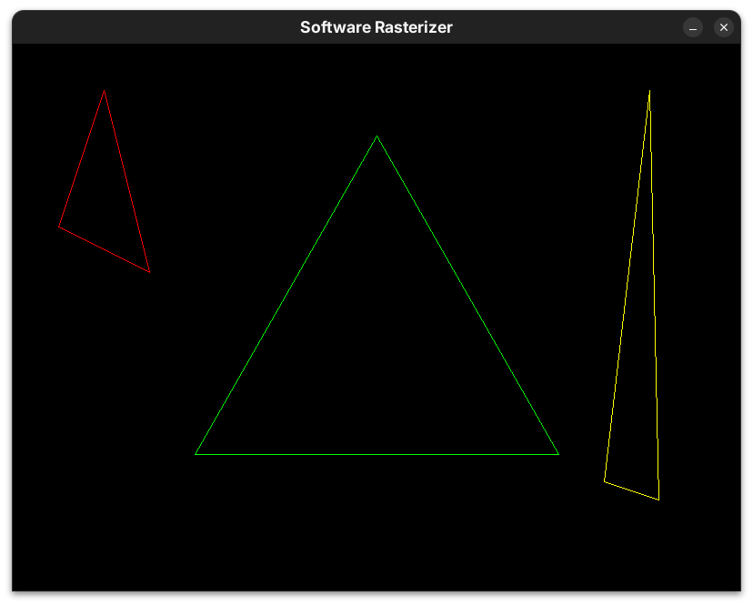

# Software Rasterizer

> Software rasterizer in C++, focused on real-time rendering and graphics pipelines.


> [!NOTE]  
> A real-time software rasterizer built from scratch in C++, focusing on the fundamentals of the graphics pipeline and memory manipulation.

## Table of Contents
- [Showcase](#showcase)
- [Core Technologies](#core-technologies)
- [Implementations](#implementations)
- [How to Run](#how-to-run)
- [Project Structure](#project-structure)
- [Roadmap](#roadmap)
- [Developer](#developer)
- [License](#license)

## Showcase
<p align="center">
    <em>Bresenham's line algorithm demonstrating various slopes and colors.</em><br>
    
    <br><br>
    <em>Wireframe triangles formed by connecting vertices with the line primitive.</em><br>
    
</p>
## Core Technologies
- C++
- SDL2
- CMake

## Implementations
- ✅ **Direct Framebuffer Access**: Manual manipulation of a `std::vector<uint32_t>` as video memory.
- ✅ **Custom Drawing Primitives:**
    - `draw_pixel`: Includes boundary checks (clipping) to prevent memory access violations.
    - `clear_screen`: Efficient buffer clearing.
- ✅ **Bresenham's Line Algorithm**: High-performance line drawing using only integer arithmetic.
- ✅ **SDL2 Integration**: Window management and real-time texture streaming.

## How to Run
- C++ Compiler (GCC/Clang/MSVC)
- CMake (3.10+)
- SDL2 Library

### Building

```bash
# Clone the repository
git clone https://github.com/avieira-dev/software-rasterizer.git
cd software-rasterizer

# Create build directory
mkdir build && cd build

# Configure and build
cmake ..
make

# Run the executable
./SoftwareRasterizer
```

## Project Structure

```text
software-rasterizer/
├── screenshots/
├── include/
├── src/
├── .gitignore
├── CMakeLists.txt
├── LICENSE
└── README.md
```

## Roadmap
- ✅ Basic Framebuffer and SDL2 Setup
- ✅ Bresenham Line Algorithm
- ✅ Wireframe Triangles
- ❌ Triangle Filling (Scanline or Barycentric)
- ❌ 3D Wireframe Cube (Projections)
- ❌ Z-Buffer (Depth testing)

## Developer
**Alexandre Vieira**  
GitHub: [@avieira-dev](https://github.com/avieira-dev)

## License
Distributed under the license [MIT License](LICENSE). See the **LICENSE** file for more details.