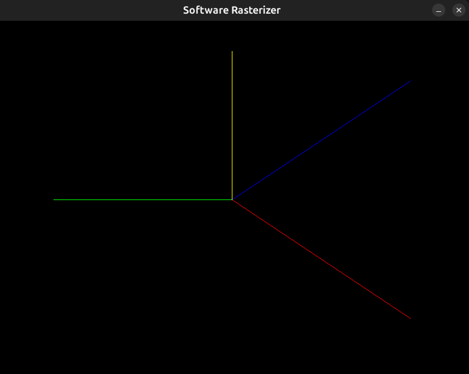
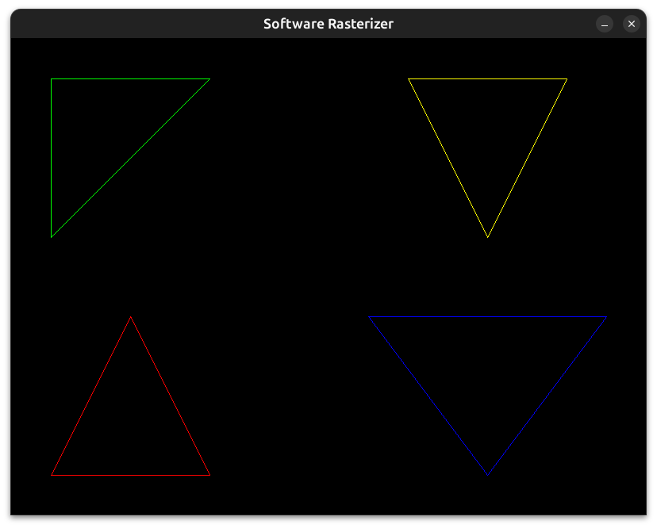
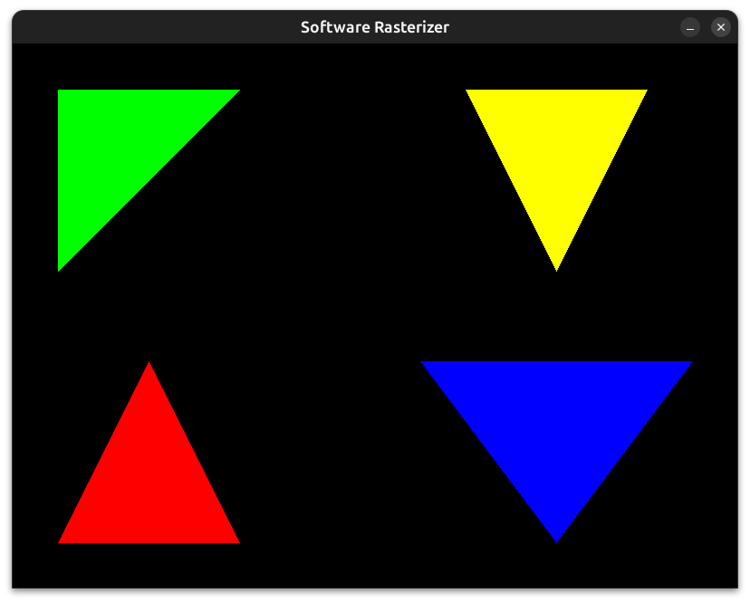
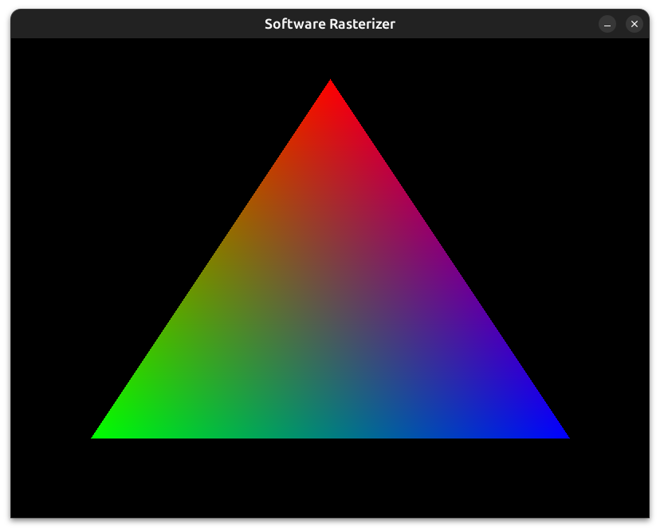

<div align="center">

<h1>Software Rasterizer</h1>

<p>A real-time software rasterizer built from scratch in C++, exploring the fundamentals of the graphics pipeline through direct memory manipulation.</p>

<p>
  
  
  
  
  
</p>

</div>

---

## Overview

This project implements a graphics pipeline entirely in software — no GPU API, no hardware rasterization. Every pixel is computed on the CPU and written to a dedicated `Framebuffer` abstraction, which internally manages a contiguous `std::vector<uint32_t>`.

The rendering algorithms are implemented in a dedicated `Rasterizer` module, keeping rasterization logic separated from framebuffer management and application code.

The current implementation explores the foundations of the rendering pipeline through pixel drawing, line rasterization, wireframe rendering, filled triangles using barycentric rasterization, and smooth vertex color interpolation.

The goal is to understand from first principles how a modern graphics pipeline works: how geometric primitives are converted into pixels, how triangle filling works, and how more advanced concepts such as transformations, clipping, depth testing, and lighting are built on top of this foundation.

**Core stack:** C++ · SDL2 · CMake

---

## Table of Contents

- [Showcase](#showcase)
- [Implementations](#implementations)
- [Roadmap](#roadmap)
- [Build & Run](#build--run)
- [Project Structure](#project-structure)
- [Author](#author)
- [License](#license)

---

## Showcase

<p align="center">
    <em>Bresenham's line algorithm — various slopes and colors</em><br>
    <br><br>
    <em>Wireframe triangles — vertices connected using the line primitive</em><br>
    <br><br>
    <em>Filled triangles — barycentric rasterization using edge functions</em><br>
    <br><br>
    <em>Vertex color interpolation — smooth color gradients using barycentric coordinates</em><br>
    
</p>

---

## Implementations

### Framebuffer
- **Framebuffer abstraction** — encapsulates a contiguous `std::vector<uint32_t>` representing video memory
- **Safe pixel access** — bounds-checked writes prevent out-of-range memory access
- **Fast buffer clearing** — efficiently resets the entire framebuffer to a single color

### Rasterizer
- **Pixel rasterization** — writes pixels through the `Framebuffer` interface
- **Bresenham's line algorithm** — integer-only line rasterization without floating-point arithmetic
- **Wireframe triangles** — rendered by connecting the three vertices with line primitives
- **Filled triangles** — barycentric rasterization using edge functions and bounding-box traversal
- **Vertex color interpolation** — smoothly interpolates vertex colors across the triangle using barycentric coordinates

### Platform
- **SDL2** — window creation, event handling, and real-time texture streaming to the display

---

## Roadmap

| Feature                                  | Status                      |
|------------------------------------------|-----------------------------|
| Framebuffer setup & SDL2 integration     | ████████████████████ `100%` |
| Bresenham line algorithm                 | ████████████████████ `100%` |
| Wireframe triangles                      | ████████████████████ `100%` |
| Filled triangles (barycentric rasterizer)| ████████████████████ `100%` |
| Vertex color interpolation               | ████████████████████ `100%` |
| 3D wireframe with perspective projection | ░░░░░░░░░░░░░░░░░░░░ `0%`   |
| Triangle clipping                        | ░░░░░░░░░░░░░░░░░░░░ `0%`   |
| Back-face culling                        | ░░░░░░░░░░░░░░░░░░░░ `0%`   |
| Z-buffer and depth testing               | ░░░░░░░░░░░░░░░░░░░░ `0%`   |
| Texture mapping                          | ░░░░░░░░░░░░░░░░░░░░ `0%`   |
| Perspective-correct interpolation        | ░░░░░░░░░░░░░░░░░░░░ `0%`   |
| Basic lighting                           | ░░░░░░░░░░░░░░░░░░░░ `0%`   |

---

## Build & Run

### Prerequisites

| Dependency                 | Version       |
|----------------------------|---------------|
| C++ compiler (GCC / Clang) | C++20         |
| CMake                      | 3.10+         |
| SDL2                       | Latest stable |

### Steps

```bash
# Clone the repository
git clone https://github.com/avieira-dev/software-rasterizer.git
cd software-rasterizer

# Configure and build
mkdir build && cd build
cmake .. && cmake --build .

# Run
./software-rasterizer
```

---

## Project Structure

```text
software-rasterizer/
├─ build/
├── include/
|   └── software-rasterizer/
│       ├── core/
│       │   └── framebuffer.hpp
│       ├── platform/
│       │   └── sdl_context.hpp
│       └── raster/
│           └── rasterizer.hpp
├── src/
│   ├── core/
│   │   └── framebuffer.cpp
│   ├── platform/
│   │   └── sdl_context.cpp
│   ├── raster/
│   │   └── rasterizer.cpp
│   └── main.cpp
├── screenshots/
├── .gitignore
├── CMakeLists.txt
├── LICENSE
└── README.md
```

---

## Author

**Alexandre Vieira**  
GitHub: **[@avieira-dev](https://github.com/avieira-dev)**

---

## License

Distributed under the [MIT License](LICENSE). See `LICENSE` for details.